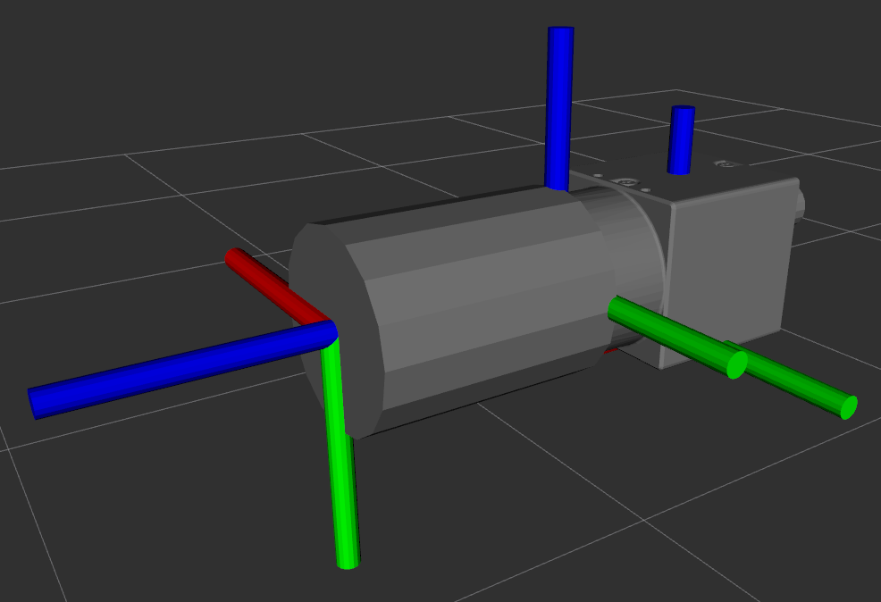

# flir_camera_description



This package contains urdf files and meshes for FLIR cameras.

## How to use
Install this package like any other ROS package, then launch the demo:
```
ros2 launch flir_camera_description demo.launch.py
ros2 run rviz2 rviz2
```
In rviz, add a "RobotModel" and set the topic to "robot_description".


## License:
Licensed under BSD License.
Copyright (c) 2012, Carnegie Mellon University. All rights reserved.
Copyright (c) 2018, Clearpath Robotics, Inc., All rights reserved.
